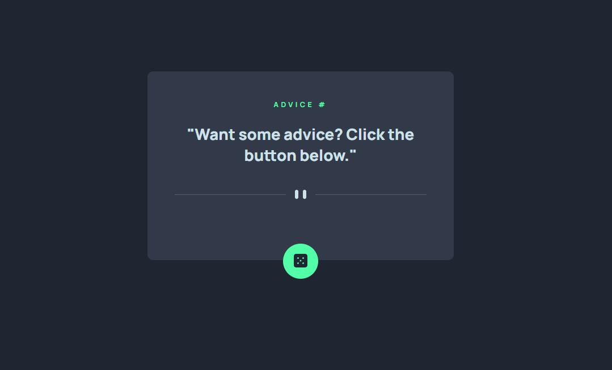

# Frontend Mentor - Solução de aplicativo gerador de conselhos

Esta é uma solução para o [desafio do aplicativo gerador de conselhos no Frontend Mentor](https://www.frontendmentor.io/challenges/advice-generator-app-QdUG-13db). Os desafios do Frontend Mentor ajudam você a melhorar suas habilidades de codificação construindo projetos realistas.

## Índice

- [Visão geral](#visão-geral)
- [O desafio](#o-desafio)
- [Captura de tela](#captura-de-tela)
- [Links](#links)
- [Meu processo](#meu-processo)
- [Construído com](#construído-com)
- [O que aprendi](#o-que-aprendi)
- [Autor](#autor)
- [Agradecimentos](#agradecimentos)

## Visão geral

### O desafio

Os usuários devem ser capazes de:

- Visualizar o layout ideal para o aplicativo, dependendo do tamanho da tela do dispositivo
- Ver os estados de foco para todos os elementos interativos na página
- Gerar um novo conselho clicando no ícone de dado

### Captura de tela

### Links

- URL da solução: [Gerador de conselhos usando API](https://github.com/MarioCarlaibe/gerador-de-conselhos-js-avancado)
- URL do site ativo: [Mário Carlaibe - GitHub](https://mariocarlaibe.github.io/gerador-de-conselhos-js-avancado/)

## Meu processo

### Criado com

- Marcação HTML5 semântica
- Propriedades personalizadas CSS
- Flexbox
- Uso API
- Javascript

### O que aprendi

Aprendi a fazer uso de API's. Nesse exercício, a parte de HTML e CSS foi bem facil, mas no Javascript eu tive dificuldades para introduzir a API de geredor de conselhos.

O fluxo do JS até que esta dando para realizar, mas ainda falta bastante treinamento. A prática leva a perfeição.

## Autor

- Site - [GitHub - Mário Carlaibe](https://github.com/MarioCarlaibe)
- Mentor de front-end - [Mário Carlaibe](https://www.frontendmentor.io/profile/MarioCarlaibe)

## Agradecimentos

Agradeço ao DevQuest pelo aprendizado e as instruções. Os professores são muito atenciosos e sempre dispostos a nos ajudar.